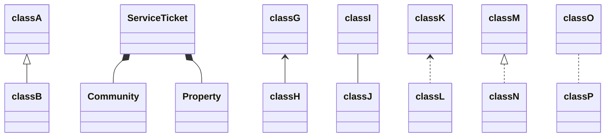

# Context: Service Ticket 

## Domain Structure:
- **ServiceTicket** (aggregate root)
  - Community (entity reference) -> Community.Community
  - Property (entity reference) -> Property.Property
  - Requestor (entity reference) -> Community.Member
  - AssignedTo (entity reference) -> Community.Member
  - ActivityDetails

