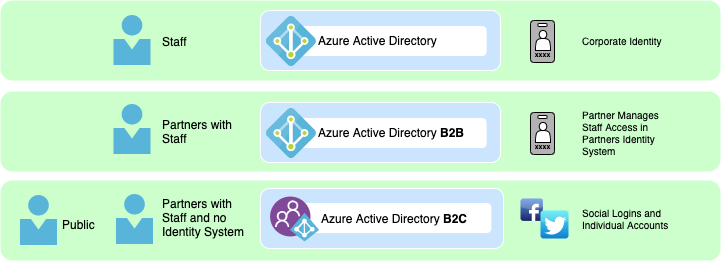

# Use of Azure Active Directory (AAD) and Azure Active Directory B2C (AAD B2C) for Identity and Access Control (WIP)

## Context and Problem Statement

The project requires a robust identity and access control solution to manage user authentication, and access to resources. The solution should support various authentication methods, provide secure access to resources, and integrate seamlessly with the project's architecture.

Partners with Staff - With Existing Identity Provider

&#x20;Leveraging Azure Active Directory B2B Direct Federation allowing the partner to leverage their existing IDP to manage employee's access to and roles granted within the application.

Administrators of Partners will log in using the MSAL configuration "admin consent" - Direct Administrators to this document to understand how to configure an application to [require user assignment ](https://docs.microsoft.com/en-us/azure/active-directory/manage-apps/assign-user-or-group-access-portal)otherwise the app will be available to all staff in the organization.

## Decision Drivers

- **User Authentication**: The solution should support various authentication methods, including social logins, multi-factor authentication, and password/passwordless authentication.
- **Security**: The solution should ensure secure authentication mechanisms to protect user data and resources.
- **Integration**: The solution should integrate seamlessly with the project's architecture and other services.
- **Developer Experience**: The solution should offer a good developer experience, including comprehensive documentation, SDKs, support, and community resources.

## Considered Options

- **Option #1: Azure Active Directory (AAD)**: Microsoft's cloud-based identity and access management service that provides secure authentication and access control for applications.
- **Option #2: Azure Active Directory B2C (AAD B2C)**: A cloud identity service that enables developers to customize and control how customers sign up, sign in, and manage their profiles when using applications.

## Decision Outcome

Chosen option: **Option #1: Azure Active Directory (AAD)** and **Option #2: Azure Active Directory B2C (AAD B2C)**

Azure Active Directory (AAD) and Azure Active Directory B2C (AAD B2C) have been chosen as the identity and access control solutions for the project. AAD provides secure authentication and access control for applications, supporting various authentication methods and seamless integration with Azure services. AAD B2C enables developers to customize and control how customers sign up, sign in, and manage their profiles when using applications, offering a flexible and scalable solution for customer identity management. Together, AAD and AAD B2C provide a comprehensive identity and access control solution that aligns with the project's requirements.

## Pros and Cons of the Options

### Azure Active Directory (AAD)

Pros:
- Secure authentication and access control for applications.
- Supports various authentication methods, including social logins, multi-factor authentication, and password/passwordless authentication.
- Seamless integration with Azure services.
- Comprehensive documentation, SDKs, and support.

Cons:
- Potential cost implications, although AAD offers various pricing tiers to accommodate different usage levels.

### Azure Active Directory B2C (AAD B2C)

Pros:
- Customizable and scalable identity management solution for customer-facing applications.
- Enables developers to customize and control how customers sign up, sign in, and manage their profiles.
- Supports social logins, multi-factor authentication, and password/passwordless authentication.
- Seamless integration with Azure services.
- Comprehensive documentation, SDKs, and support.

Cons:
- Potential cost implications, although AAD B2C offers various pricing tiers to accommodate different usage levels.

## Links
- [SCIM Decision Tree](https://docs.microsoft.com/en-us/azure/active-directory/app-provisioning/scim-graph-scenarios)
- [Azure Active Directory Documentation](https://docs.microsoft.com/en-us/azure/active-directory/)
- [Azure Active Directory B2C Documentation](https://docs.microsoft.com/en-us/azure/active-directory-b2c/)
- [Microsoft's Multi-tenant SAAS Sample](https://github.com/mspnp/multitenant-saas-guidance)
- [Handling multiple issuers](https://docs.microsoft.com/en-us/azure/active-directory/develop/howto-convert-app-to-be-multi-tenant#update-your-code-to-handle-multiple-issuer-values)
- [Tenant Signup Documentation](https://docs.microsoft.com/en-us/azure/architecture/multitenant-identity/signup) - Admin Consent
- [MultiTentant Highlevel docs ](https://docs.microsoft.com/en-us/azure/architecture/multitenant-identity/)
- [Requesting Admin Consent with React](https://docs.microsoft.com/en-us/azure/active-directory/develop/howto-convert-app-to-be-multi-tenant)
- OIDC / SCIM projects&#x20;
  * [Janssen](https://github.com/JanssenProject) Project (by Glluu) &#x20;
- [https://docs.microsoft.com/en-us/azure/active-directory/develop/howto-convert-app-to-be-multi-tenant](https://docs.microsoft.com/en-us/azure/active-directory/develop/howto-convert-app-to-be-multi-tenant)