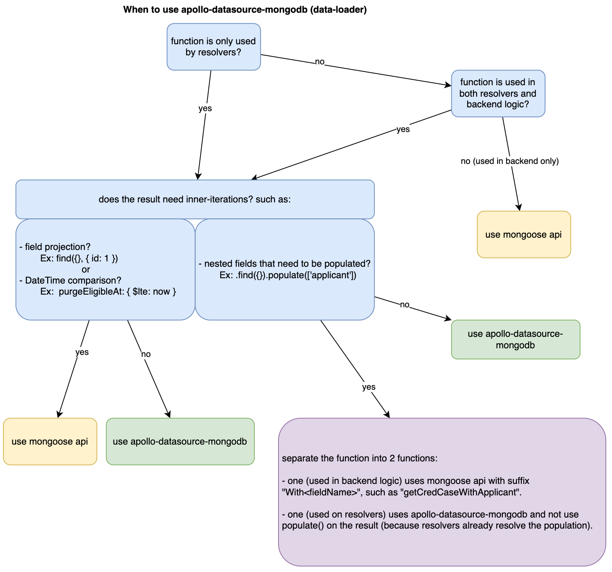
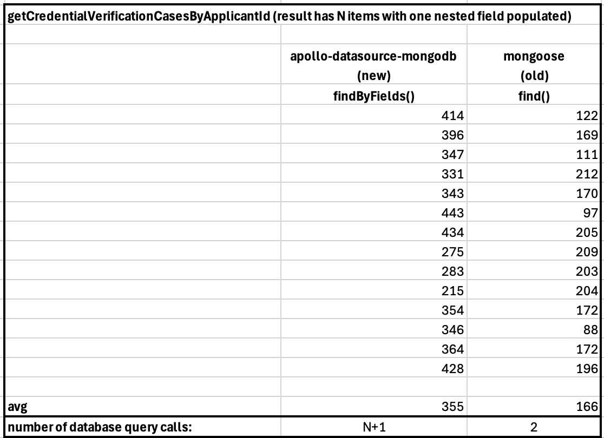
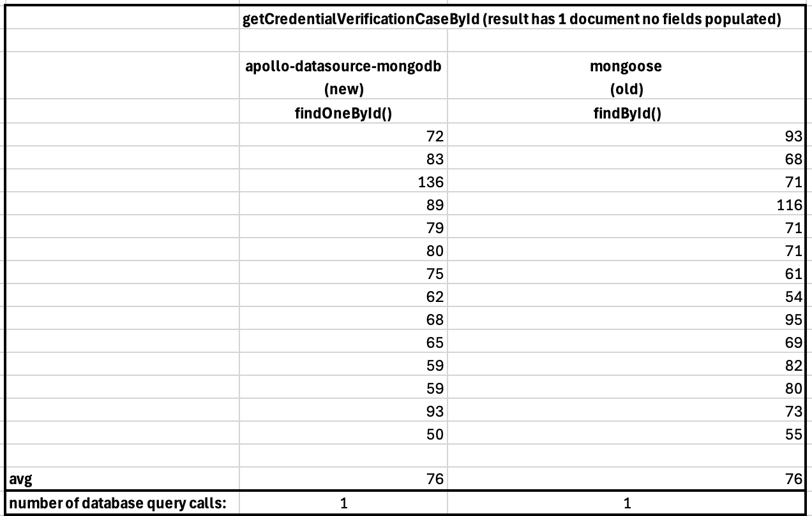
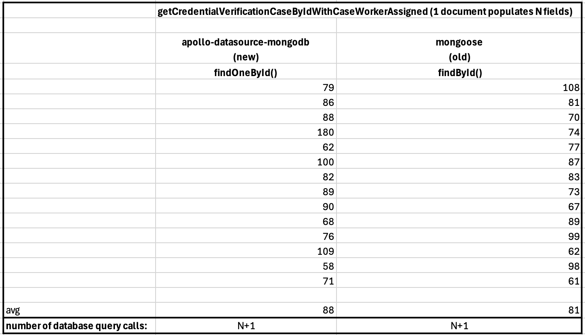
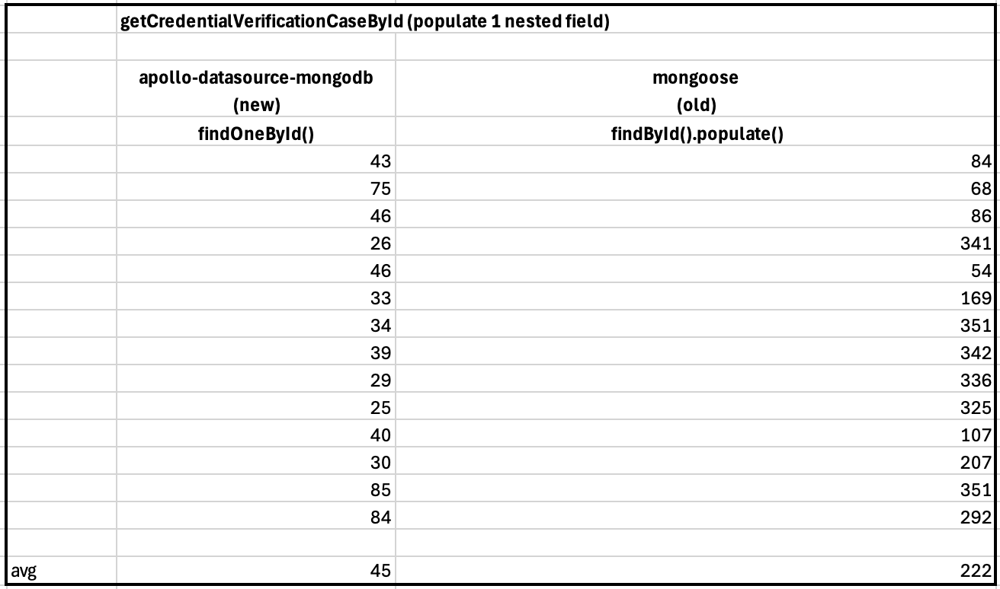

# Use of apollo-datasource-mongodb vs Mongoose APIs

## Context and Problem Statement

When querying MongoDB, we need to decide whether to use `apollo-datasource-mongodb` (data-loader) or the native Mongoose APIs. This decision depends on factors such as the function's usage scope (resolvers vs backend logic), the need for field projections, datetime comparisons, and nested field population.

## Decision Drivers  

- **Query Performance**: We need to minimize redundant database queries and avoid the [N+1 problem in GraphQL resolvers](https://www.apollographql.com/tutorials/dataloaders-dgs/02-the-n-plus-1-problem).  
- **Code Maintainability**: The approach should make it easy to manage queries across resolvers and backend logic.  
- **Feature Requirements**: Some queries require field projection, datetime filtering, or population of nested fields.  
- **Consistency**: Queries should be handled in a predictable and structured way across our service.  

## Considered Options

1. **Use `apollo-datasource-mongodb`**
2. **Use Mongoose APIs**
3. **Separate functions for resolvers and backend logic**

## Decision Outcome

The decision is based on the following criteria:

### 1. If the function is **only used by resolvers**:
   - **Check if the resulting array needs inner iterations**:
     - **If yes** (e.g., field projection like `{ id: 1 }`, a datetime comparison such as `{ $lte: now }`, or nested field populate `find({}).populate(['applicant'])`), **use Mongoose APIs**.
     - **If no**, **use `apollo-datasource-mongodb`**.

### 2. If the function is **used in both resolvers and backend logic**:
   - **If no nested fields need to be populated**, **use `apollo-datasource-mongodb`**.
   - **If nested fields need to be populated**, **separate the function into two**:
     - One for backend logic using **Mongoose APIs** named with suffix `With<fieldName>` (e.g., `getCredCaseWithApplicant`).
     - One for resolvers using **`apollo-datasource-mongodb`**, but without `populate()`, since resolvers will handle population.

### 3. If the function is **only used in backend logic**, **use Mongoose APIs**.

## Decision

We will follow the structured approach outlined above to determine when to use `apollo-datasource-mongodb` versus Mongoose APIs. This ensures:
- Optimized query performance.
- Avoiding unnecessary data fetching in resolvers.
- Proper separation of concerns between backend logic and GraphQL resolvers.

## Pros and Cons of the Options

### Use `apollo-datasource-mongodb`
✅ Improve UI performance thanks to the benefits from [data-loader](https://github.com/GraphQLGuide/apollo-datasource-mongodb?tab=readme-ov-file).  
❌ Can lead to N+1 query issues.  
❌ Not ideal for complex filtering, projections, or nested field population.  

### Use Mongoose APIs
✅ Allows full control over queries, including projections, filtering, and population.  
✅ More efficient for backend-only functions that don’t require GraphQL resolvers.  
❌ Does not leverage the benefits from Apollo's data loader.  

### Separate Functions for Resolvers and Backend Logic
✅ Ensures resolvers don’t perform unnecessary `populate()` operations.  
✅ Keeps backend logic optimized for different use cases.  
❌ Requires maintaining two versions of the same function.  

## Status

**Accepted** – We will apply this approach when implementing MongoDB queries in our data-access.

## Consequences

- Developers must assess each query based on its usage context.
- Functions used in both backend and resolvers need to be split appropriately.
- Queries in resolvers should avoid `populate()`, relying on GraphQL resolvers to handle data population.

## MORE INFORMATION

- Decision Tree for choosing between `apollo-datasource-mongodb` and Mongoose APIs:

- Performance comparison between `apollo-datasource-mongodb` and Mongoose APIs:
  - **Result has N documents with one nested field populated**:

  - **Result has 1 documents with no fields populated**:

  - **Result has 1 documents with multiple nested fields populated**:

  - **Time added by a redundant populate() call**:

