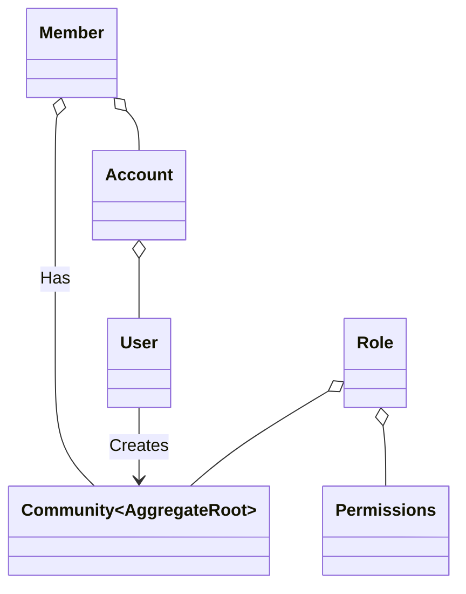

# DDD FAQ

> **Location:** `ownercommunity/data-access/src/app/domain/contexts/community/community.ts`

## What qualifies as an [Entity](../decisions/domain-driven-design#entity)?

In Domain Driven Design (DDD), an object qualifies as an entity if it meets the following criteria:

1. **Unique Identity:** It must have a unique identifier that distinguishes it from other instances, even if other attributes are identical.
2. **Mutable State:** Unlike value objects, entities can change their properties or state while retaining their identity.
3. **Encapsulates Business Rules:** It contains business logic and rules that dictate how its state can be changed and interacted with.
4. **Lifecycle Management:** Entities have clear lifecycle management, with creation, updates, and possibly deletion being part of their behavior.

#### Examples in the Owner Community space:

- Community
- Member
- Account

## What qualifies as an [Aggregate-Root](../decisions/domain-driven-design#aggregate-root)?

In Domain Driven Design (DDD), an object qualifies as an [Aggregate-Root](../decisions/domain-driven-design#aggregate-root) if it meets the following criteria:

1. **Single Point of Entry:** From a DDD perspective, Aggregate Roots are the only members of an aggregate that external objects are allowed to hold references to.
2. **Boundary of an Aggregate:** It serves as the boundary for a cluster of associated objects (entities and value objects), treated as a single unit.
3. **Domain Rule Enforcement:** It is responsible for enforcing business rules across the aggregate, ensuring that the rules are applied correctly to maintain business logic integrity.

#### Examples in the Owner Community space:

- Community

## How can the Own Community domain be visualized?

