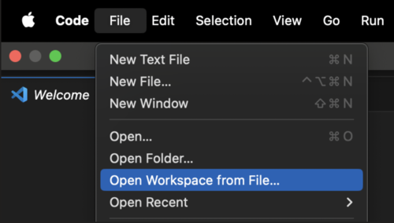

# Installation

### Requirements
* **Node.js and npm (Node Package Manager)**: Owner Community is a React project. Make sure you have Node.js installed on your machine, as it includes npm.
You can check your Node.js version by running node -v and your npm version by running npm -v in your terminal or command prompt.

* **TypeScript and JSX**: This project is written in TypeScript and uses JSX syntax for defining React components.

### Setting Up A Local Version of Owner Community
**1. Clone the project**
```
cd <<path to repos>>
```

```
git clone git@github.com/simnova/ownercommunity.git ownercommunity
```

**2. Open VS Code**
```
code .
```

**3. Choose "add folder to workspace" and add the "ownercommuntiy" directory**

**4. Access repo in VSCode using workspace option**:



**5. Open a terminal in the project and navigate to the each of the following directories**:
      * **ui**
      * **data-access**
      * **docusaurus** <br></br> 
      
      **and enter the command below**:
```
npm install
```

### Directory Structure
This structure represents the ownercommunity directory and its subdirectories, each containing various files and folders specific to their respective purposes.
```
ownercommunity/
├── az-bicep/
│ ├── other files and folders
├── b2c/
│ ├── other files and folders
├── data-access/
│ ├── other files and folders
├── docusaurus/
│ ├── other files and folders
├── iac-global/
│ ├── other files and folders
├── ui-community/
│ ├── other files and folders
├── ui-whitelabel-wrapper/
│ ├── other files and folders
├── .gitignore
├── LICENSE
├── ownercommunity.code-workspace
└── README.md
```

### Directory Structure Rundown
The ***ui-community*** directory primarily houses frontend-related files and assets. It contains subdirectories such as <u>"src"</u> which contains more subdirectories including "components" for reusable UI components and <u>"pages"</u>  for page-level components for both the admin and member roles in owner community as well as shared components and pages, <u>"styles"</u> for stylesheets defining the UI's appearance, and <u>"assets"</u> for static files like images and fonts. Overall, the ***"ui-community"*** directory encapsulates all frontend-related aspects of the project, facilitating the development and maintenance of the user interface.

The ***data-access*** directory serves as the backend portion of the project. It includes subdirectories such as <u>"graphql"</u> for GraphQL schema among others. Overall, the <u>"data-access"</u> directory encapsulates backend functionality related to GraphQL, authentication, and application domain logic, facilitating data management and server-side operations within the project.

The ***docusaurus*** directory houses all documentation pertaining to this project. All documentation can be foudn in the <u>"docs"</u> subdirectory, the <u>"src"</u> subdorectory contains the components, css, and pages subdirectories that dictate the look of the dosumnetation, and the "static" directory contains static files like images.
