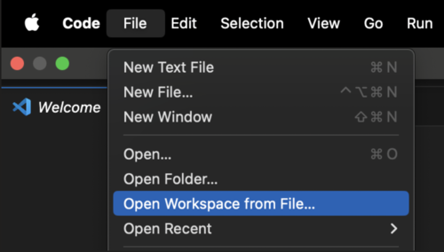

# Getting Started

### Setting Up A Local Version of Owner Community

**1. Clone the project**
```
cd <<path to repos>>
```

```
git clone git@github.com/simnova/ownercommunity.git ownercommunity
```

**2. Open VS Code**
```
code .
```

**3. Choose "add folder to workspace" and add the "ownercommuntiy" directory**

**4. Access repo in VSCode using workspace option**:




**5. Create a **.env** file in the base of the **ui** folder of the project and copy the values below into it**:
```
VITE_FUNCTION_ENDPOINT=http://localhost:7071/api/graphql   
VITE_APP_INSIGHTS_CONNECTION_STRING=InstrumentationKey=4c426ba1-cb2c-43ee-96b5-04aa3c7b52e1;IngestionEndpoint=https://eastus2-3.in.applicationinsights.azure.com/;LiveEndpoint=https://eastus2.livediagnostics.monitor.azure.com/
# AAD App Registrations > Applicaiton (client) ID  
VITE_AAD_ACCOUNT_CLIENTID=252e70d9-6c17-47fa-b202-9a4e842fd6e3  
# https://<<TENANT NAME>>.b2clogin.com/<<TENANT NAME>>.onmicrosoft.com/<<CUSTOM POLICY NAME>>   
VITE_AAD_ACCOUNT_AUTHORITY=https://ownercommunityb2c.b2clogin.com/ownercommunityb2c.onmicrosoft.com/B2C_1A_SIGNUP_SIGNIN   
# <<Applicaiton (client) ID>>|openid 
VITE_AAD_ACCOUNT_SCOPES=openid
# https://<<TENANT NAME>>.b2clogin.com/<<TENANT NAME>>.onmicrosoft.com/<<CUSTOM POLICY NAME>>/oauth2/v2.0/authorize?p=<<CUSTOM POLICY NAME>>  
VITE_AAD_KNOWN_AUTHORITIES=https://ownercommunityb2c.b2clogin.com/ownercommunityb2c.onmicrosoft.com/oauth2/v2.0/authorize?p=B2C_1A_SIGNUP_SIGNIN  
# Where to redirect to after login 
VITE_AAD_REDIRECT_URI=http://localhost:3000  
VITE_PORTAL_IDENTIFIER=ownercommunity-member 
# Feature flag url
VITE_FEATURE_FLAG_URL=https://ownercommunity.blob.core.windows.net/feature-flag/feature-flag.json
VITE_TIMEOUT_BEFORE_MAINTENANCE=120
```

<br></br>
**6. Create a <u>local.settings.json</u> file in the base of the <u>data-access</u> folder of the project and copy the value below into it**:
```
{
  "IsEncrypted": false,
  "Values": {

    "MAPS_AZURE_SUBSCRIPTION_ID-INFO": "this is the subscription id of the map app identity",
    "MAPS_AZURE_SUBSCRIPTION_ID": "",

    "MAPS_RESOURCE_GROUP-INFO": "this is the resource group of the azure map app",
    "MAPS_RESOURCE_GROUP": "rg-owner-community",

    "MAPS_OBJECT_PRINCIPAL_ID-INFO": "this is the principal id of the map app identity",
    "MAPS_OBJECT_PRINCIPAL_ID": "",  

    "MAPS_ACCOUNT_NAME-INFO": "this is the name of the azure map account",
    "MAPS_ACCOUNT_NAME": "oc-maps",

    "VERCEL_TOKEN" : "",
    "VERCEL_PROJECT" : "ownercommunity-firsthit",

    "CONTENT_MODERATOR_SUBSCRIPTION_KEY": "",
    
    "CONTENT_MODERATOR_ENDPOINT": "https://oc-cm.cognitiveservices.azure.com/",


    "APPLICATIONINSIGHTS_CONNECTION_STRING": "";
    IngestionEndpoint=https://westus2-2.in.applicationinsights.azure.com/",
    
    "BLOB_ACCOUNT_NAME": "ownercommunity",
    "BLOB_ACCOUNT_KEY": "",
    
    "ACCOUNT_PORTAL_OIDC_ENDPOINT" : "https://ownercommunityb2c.b2clogin.com/ownercommunityb2c.onmicrosoft.com/b2c_1a_signup_signin/discovery/v2.0/keys",
    "ACCOUNT_PORTAL_OIDC_AUDIENCE-info": "this comes from a B2C appliction -> B2C Appliction ClientID",
    "ACCOUNT_PORTAL_OIDC_AUDIENCE": "http://localhost:3000/",
    "TO_GET_ACCOUNT_PORTAL_OIDC_ISSUER":"look it up from OIDC ENDPOINT",
    "ACCOUNT_PORTAL_OIDC_ISSUER": "https://ownercommunityb2c.b2clogin.com/9227e22b-4754-46be-98c1-2a1a1e40457e/", 
    "FUNCTIONS_WORKER_RUNTIME": "node",
    "AzureWebJobsStorage": "",
    "COSMOSDB": << removed >>,
    "COSMOSDB_POOL_SIZE": "10",
    "COSMOSDB_DBNAME": "owner-community",

    "SEARCH_API_ENDPOINT" : "https://owner-community-search.search.windows.net",
    "SEARCH_API_KEY" : "",

    "languageWorkers:node:arguments": "--inspect=5858",
    "NODE_ENV": "development"
  },
  "Host": {
    "LocalHttpPort": 7071,
    "CORS": "*"
  }
}
```
<br></br>

**7. Open a terminal in the project and navigate to the each of the following directories**:
      * **ui**
      * **data-access**
      * **docusaurus** <br></br> 
      
      **and enter the command below**:
```
npm install
```
    

