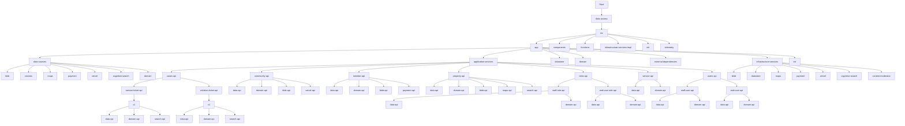

# Code Organization

```mermaid

graph TD;
    A[Root] --> B[data-access]
    B --> C[src]
    C --> D[app]
    C --> E[components]
    C --> F[functions]
    C --> G[infrastructure-services-impl]
    C --> H[init]
    C --> I[telemetry]
    D --> J[application-services]
    D --> K[data-sources]
    D --> L[datastore]
    D --> M[domain]
    D --> N[external-dependencies]
    D --> O[infrastructure-services]
    D --> P[init]
    K --> K1[blob]
    K --> K2[cosmos]
    K --> K3[maps]
    K --> K4[payment]
    K --> K5[vercel]
    K --> K6[cognitive-search]
    K --> K7[domain]
    J --> J1[cases-api]
    J1 --> J1.a[service-ticket-api]
    J1.a --> J1.a.1[v1]
    J1.a.1 --> J1.a.1.A[data-api]
    J1.a.1 --> J1.a.1.B[domain-api]
    J1.a.1 --> J1.a.1.C[search-api]
    J1 --> J1.b[violation-ticket-api]
    J1.b --> J1.b.1[v1]
    J1.b.1 --> J1.b.1.A[data-api]
    J1.b.1 --> J1.b.1.B[domain-api]
    J1.b.1 --> J1.b.1.C[search-api]
    J --> J2[community-api]
    J2 --> J2.a[data-api]
    J2 --> J2.b[domain-api]
    J2 --> J2.c[blob-api]
    J2 --> J2.d[vercel-api]
    J --> J3[member-api]
    J3 --> J3.a[data-api]
    J3 --> J3.b[domain-api]
    J3 --> J3.c[blob-api]
    J3 --> J3.d[payment-api]
    J --> J4[property-api]
    J4 --> J4.a[data-api]
    J4 --> J4.b[domain-api]
    J4 --> J4.c[blob-api]
    J4 --> J4.d[maps-api]
    J4 --> J4.e[search-api]
    J --> J5[roles-api]
    J5 --> J5.a[staff-role-api]
    J5.a --> J5.a.A[data-api]
    J5.a --> J5.a.B[domain-api]
    J5 --> J5.b[end-user-role-api]
    J5.b --> J5.b.A[data-api]
    J5.b --> J5.b.B[domain-api]
    J --> J6[service-api]
    J6 --> J6.a[data-api]
    J6 --> J6.b[domain-api]
    J --> J7[users-api]
    J7 --> J7.a[staff-user-api]
    J7.a --> J7.a.A[data-api]
    J7.a --> J7.a.B[domain-api]
    J7 --> J7.b[end-user-api]
    J7.b --> J7.b.A[data-api]
    J7.b --> J7.b.B[domain-api]
    O --> O1[blob]
    O --> O2[datastore]
    O --> O3[maps]
    O --> O4[payment]
    O --> O5[vercel]
    O --> O6[cognitive-search]
    O --> O7[content-moderator]

```